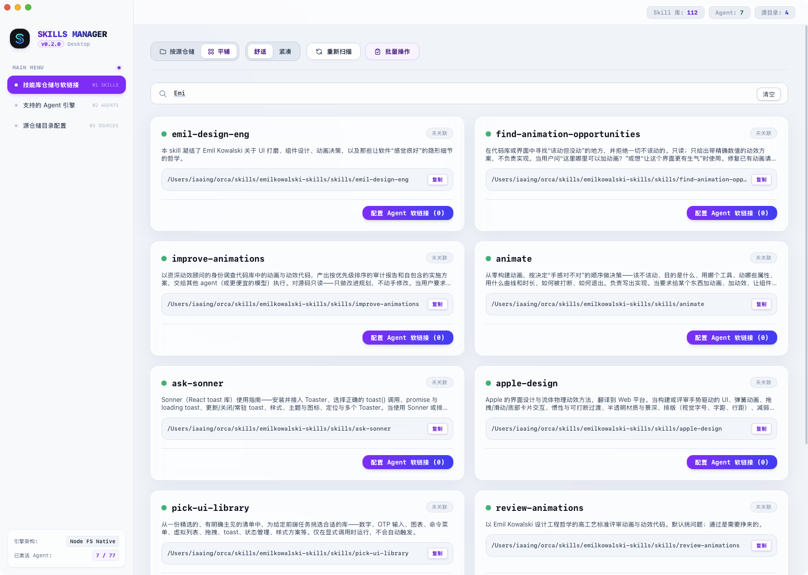
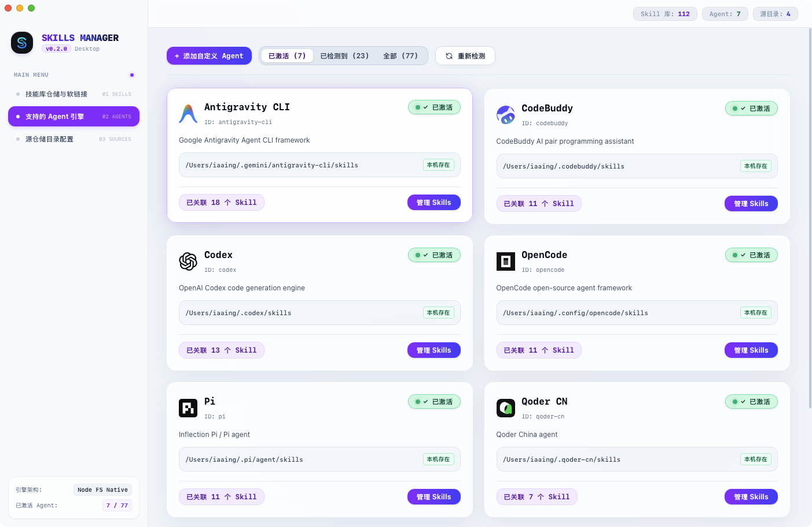
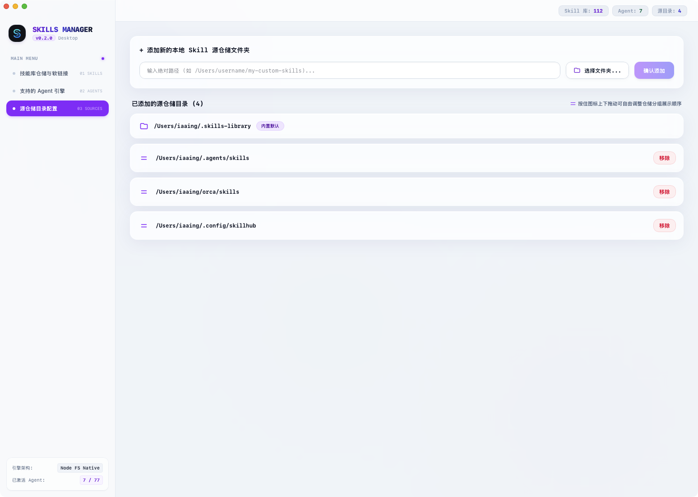

# 🚀 Skills Manager

<p align="center">
  <strong>专为 AI Agent 打造的高效 Agentic Skill 软链接可视化管理桌面应用</strong>
</p>

<p align="center">
  
  
  
  
  
  
</p>

---

## 🌟 简介 (Overview)

**Skills Manager** 是一款原生质感、超快流畅的 macOS 桌面端工具，旨在帮助 AI 开发者与 Agentic 架构使用者高效管理本地的 Skill 技能包及其在各个 AI Agent 引擎（如 Antigravity CLI, SkillHub 等）之间的符号软链接（Symlink）关联关系。

借助 **Tauri 2.0 + Rust 原生底层文件系统引擎**，Skills Manager 摆脱了传统 Electron 的臃肿体积，拥有毫秒级响应速度与低内存占用。

---

## 🖼 界面预览 (Screenshots)

<p align="center">
  
</p>

<p align="center">
  
</p>

---

## 📖 快速上手与使用指南 (Quick Start)

### 1. 配置 Skill 源仓储目录 (Source Directory Setup)

进入左侧菜单 **「源仓储目录配置」**：

- **添加本地源仓储**：点击「选择文件夹...」唤起 macOS 原生文件选择器选择目标文件夹，或直接粘贴本地 Skill 存放路径，点击「确认添加」。
- **自定义拖拽排序**：按住目录左侧的拖拽图标（`=`），上下拖动即可自由调整各个源仓储在主列表中的显示优先顺序。
- **安全管理**：除了系统默认固定第一位的 `~/.skills-library` 外，自定义源目录随时支持一键移除。

<p align="center">
  
</p>

---

### 2. 浏览多层级 Skill 目录树与快捷配置 (Tree Navigation)

在 **「技能库仓储与软链接」** 主视图中：

- **多层级目录树**：按仓储自动展开层级目录，子文件夹可自由收起/展开，自动压缩单子级路径，直观展示文件夹关联。
- **单 Skill 管理**：点击任意 Skill 卡片右侧的「配置 Agent 软链接」，即可勾选将其挂载至特定的 Agent 引擎目录。

---

### 3. 全局批量操作与一键挂载 (Batch Management)

- **开启批量模式**：点击右上角「批量操作」按钮激活管理状态（顶部导航菜单自动锁定保护）。
- **目录级全选 / 反选**：点击任意仓储或子文件夹右侧的复选框，一键全选或取消全选该目录下的所有 Skill（支持半选 `[-]` 状态显示）。
- **跨仓储自定义多选**：直接点击任意 Skill 卡片进行自定义勾选，屏幕底部将自动出现吸睛的浮动操作工具栏。
- **一键批量挂载/解绑**：在底部悬浮栏中选择「+ 批量挂载软链接」或「批量移除软链接」，即可批量分发或取消挂载。

---

## ✨ 核心特性 (Features)

- ⚡️ **Tauri 2.0 + Rust 原生底层引擎**：纯 Rust 原生处理路径检测、读写与符号软链接（Symlink）原子挂载，安全高效。
- 📁 **多仓储层级目录树 (Directory Tree Engine)**：
  - 自动递归检测指定源仓储下的子目录嵌套结构。
  - 支持多层级点按收起与展开，压缩无意义单子级文件夹链条，消除密集乱象。
- 📦 **全局批量操作管理 (Batch Management)**：
  - 一键开启“批量操作”状态，顶部全局锁定菜单避免误操作。
  - **目录全选框**：按仓储或子文件夹层级一键全选/反选包含的全部技能（支持半选 `[-]` 状态显示）。
  - **跨目录多选**：支持自定义勾选任意 Skill，底部弹出吸睛浮动工具栏，一键批量挂载或移除软链接。
- 🤖 **Agent 智能体全景视角 (Agent Handoff & Auto Detection)**：
  - 自动探测本机安装的 Agent 智能体列表（如 Antigravity CLI、SkillHub 等）。
  - 支持快速查看指定 Agent 挂载的所有软链接与原生实体 Skill。
  - 支持自定义新建扩展 Agent 软链接映射目录。
- 🎨 **纯正 macOS 原生精致视觉**：
  - 磨砂玻璃（Backdrop Blur）拟态视觉与极窄圆角卡片。
  - 提供“紧凑”（Compact）与“舒适”（Normal）双重布局视图，满足不同屏幕密度需求。

---

## 📦 下载与安装 (Download)

请前往项目 [Releases 页面](https://github.com/iaaiNG/skills-manage-ui/releases) 下载最新的 macOS 安装包：

- **macOS (Apple Silicon / Intel)**: `Skills Manager_0.2.0_aarch64.dmg`

> **提示**：安装后拖拽至 `Applications` 目录即可开启运行。

---

## 🛠 本地构建与开发 (Development & Build)

### 1. 前置依赖 (Prerequisites)

- [Node.js](https://nodejs.org/) (>= 18)
- [Rust Toolchain](https://www.rust-lang.org/) (>= 1.77.2)
- Xcode Command Line Tools (macOS)

### 2. 克隆仓库与安装依赖

```bash
git clone https://github.com/iaaiNG/skills-manage-ui.git
cd skills-manage-ui
npm install
```

### 3. 本地开发 (Development)

启动 Tauri 2.0 桌面应用开发服务：

```bash
npm run tauri:dev
```

### 4. 生产构建打包 (Production Build)

编译构建 macOS `.app` 与 `.dmg` 安装包：

```bash
npm run tauri:build
```

构建生成的产物将存放在：
`src-tauri/target/release/bundle/dmg/Skills Manager_0.2.0_aarch64.dmg`

---

## ⭐ 支持与致谢 (Give Us a Star)

如果 **Skills Manager** 为您的 AI Agent 技能开发与软链接管理带来了便利，欢迎点个 **⭐ Star** 支持本项目！您的鼓励是我们持续迭代与维护的最大动力！

<p align="center">
  <a href="https://github.com/iaaiNG/skills-manage-ui">
    
  </a>
</p>

---

## 📄 开源协议 (License)

本项目采用 [MIT License](LICENSE) 协议开源。欢迎提交 Issue 与 Pull Request！
